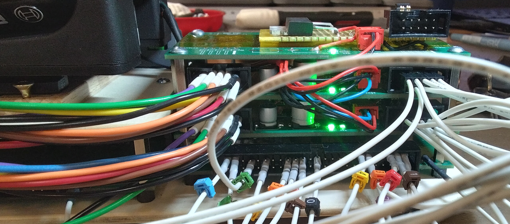
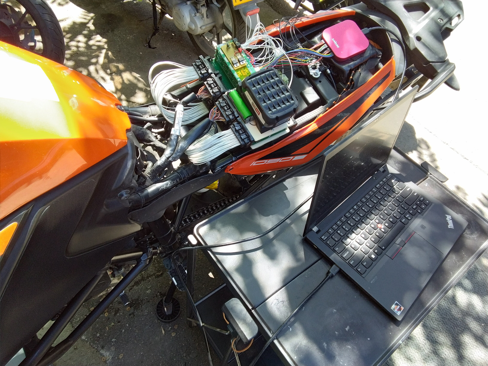

<a href="https://scan.coverity.com/projects/rodan-eecu-sat">
  
</a>

## eecu-sat (Engine ECU signal acquisition tool)

set of multiple modules that allow all analog signals generated and received by a vehicle's Engine Electronic Control Unit to be captured and analyzed. it can either be used as a testing jig for EECUs or as a low level diagnostic tool in which a known good set of signals can be used as reference.



a number of filters and buffers are used to protect the ADCs from transient spikes generated by all inductive loads

```
 source:       https://github.com/rodan/eecu-sat
 author:       Petre Rodan <2b4eda@subdimension.ro>
 license:      GNU GPLv3

 software architecture based on libsigrok and sigrok-cli
 source:       https://sigrok.org
 author:       Bert Vermeulen
 license:      GNU GPLv3
```

more images of the prototype in action are available [here](https://photos.app.goo.gl/Gay5FS8gsCTZkYcH9)

## Project components

project directory structure

 * ./hardware/buffy - kicad based schematics and pcbs for the analog buffer stage
 * ./hardware/pb\_jst-zro*  - kicad based schematics and pcbs for the proxy boards that intercept all EECU signals for a KTM 1090 EECU that uses JST ZRO 36 and 48 pin connectors
 * ./ltspice - spice simulation of the analog buffer schematic
 * ./software/eecu-sat - program that processes the raw analog data exported by [Saleae's Logic](https://www.saleae.com/pages/downloads) and converts them into [sigrok](https://sigrok.org/wiki/File_format:Sigrok/v2) files
 * .doc/ktm\_1090\_wiring.ods - ktm 1090 ECU pinout based on wire harness specs present in the service manual

## eecu-sat software

The software's code is shaped around the [sigrok](https://sigrok.org) library which is a great open-source signal analysis suite. I would have preferred to simply patch libsigrok and sigrok-cli to support the functionality that was needed for this project, however things did not go that smoothly. AFAICT libsigrok assumes that all input signals formats are interlaced, which makes sense from an acquisition system standpoint - samples are usually read by a single thread by switching channels in a loop. so CH1\_sample, CH2\_sample ... CH16\_sample, CH1\_sample, CH2\_sample ... in a row. Also it only supports single-file inputs. Quoting a libsigrok source file,

```
Saleae Logic applications typically export one file per channel. The sigrok
input modules exclusively handle an individual file, existing applications
may not be prepared to handle a set of files, or handle "special" file types
like directories. Some of them will even actively reject such input specs.
Merging multiple exported channels into either another input file or a sigrok
session is supposed to be done outside of this input module.
```

This is the reason why the code is basically a fork of sigrok-cli that contains my own input, output and transform modules that treat all samples in a non-interlaced manner.

### Build requirements

#### Linux
Notable dependencies would be a gcc, make, libzip and the libsigrok headers.

```
cd ./software/eecu-sat
make
```

#### FreeBSD

this is 'Work in progress', not functional just yet. dependencies: gcc13, gmake, gsed

```
export CC='/usr/local/bin/gcc13'
cd ./software/eecu-sat
gmake
```

### Usage

a [manual](./doc/eecu-sat.1.md) is provided
```
man ./doc/eecu-sat.1
```

***SYNOPSIS***

eecu-sat [-hv] [-i, --input FILENAME_MATCH ] [-o, --output FILE\_PREFIX] [-O, --output-format OUTPUT ] [-t, --triggers TRIGGERS ] [-T, --transform-module TRANSFORM ] [-L, --list]

### TODO list (In Progress)

- [ ] analyze all 48 channels and automatically detect faults based on a known good reference capture
- [x] synchronize multiple sets of 16 channel acquisitions into one 48 channel srzip file
- [x] crop intervals in a signal, based on a trigger definition
- [x] convert Logic exported raw analog signals into srzip files that can be loaded in pulseview
- [x] relabeling capability of channels when seen in pulseview
- [x] 3-point calibration of all analog channels
  - [x] use ini file to input calibration paramenters
  - [x] analyze analog calibration signals, detect the calibration points
  - [x] apply acceptance criteria to input calibration signal
  - [x] export slopes and offsets into calibration ini file




